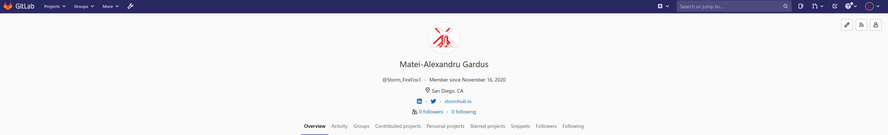

# Welcome to Matei's CSE 110 Lab 1!

## TL;DR

[Here's my resume.](https://stormhub.io/Resume.pdf) You can also go to [YouTube](https://www.youtube.com/watch?v=dQw4w9WgXcQ) from here, just for fun.

## Hi!

I'm Matei-Alexandru Gardus, a second-year CS student at UC San Diego. I like:
- DevOps
- Ansible and the like
- using Arch Linux
- Vim AND Emacs
- winging it through React
- enjoying nature occasionally
- putting off working out
- REST-based microservices
- systematic automation of life
- basic machine learning
- debating about literally anything
- fixing bugs I made
- waiting for programs to compile
- educational programming courses
- blowing up transistors
- tinkering with new devices
- every language but JavaScript
- making you laugh, I hope
- min-maxing everything
- writing articles about anything
- talking all the time
- side-project marathons
- system administration
- reading stuff off Reddit
- editing videos
- cooking and baking
- skiing
- HTML?
- using Stack Overflow

## What do I do in my free time?

I typically spend a lot of time doing _chaotic_ stuff to have fun with my friends **and** family! This
also involves stuff like skits, as well, most of which are pretty good inside jokes. Here's what my friend,
totally not a paid actor, said about my skits:

> I approve of these skits!

I also spend a lot of time doing DevOps stuff, particularly deploying services to my personal server.
For instance, here's a screenshot of my personal GitLab profile at [git.stormhub.io](https://git.stormhub.io):



I guess, if you wanted to, you could also [go to the image directly with a relative link](./gitlab-screenshot.png).

## Here's some code I've wrote at one time!

```js
console.log("Hello World!");
```

```cpp
std::cout << "Hello World!" << std::endl;
```

```go
package main

import fmt

func main() {
    fmt.Println("Hello World")
}
```

## TODO

- [X] Finish README
- [X] Take screenshots
- [X] Finish site
- [ ] Publish to GitHub Pages
- [ ] Submit to Canvas

[Get me back to the top!](#welcome-to-mateis-cse-110-lab-1)
